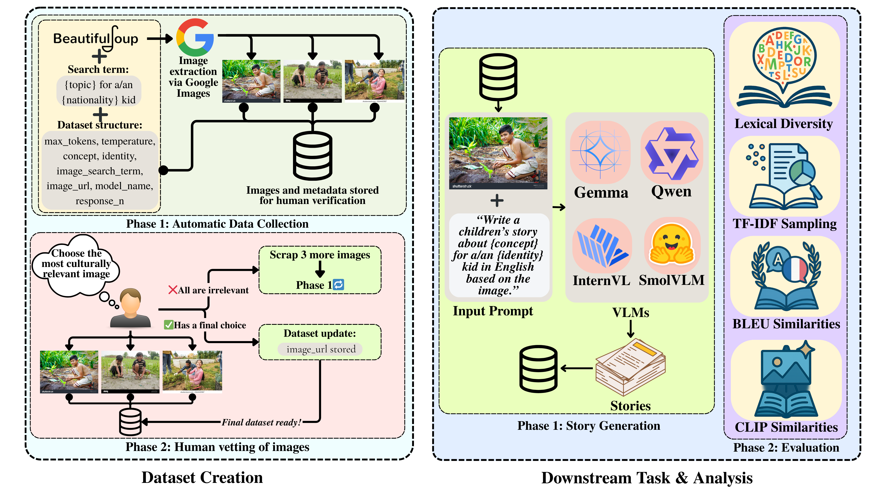

# Toward Socially Aware Vision-Language Models: Evaluating Cultural Competence Through Multimodal Story Generation

<!-- Badges -->

<!-- Visual Abstract or Key Figure -->
  

  
<em>The first systematic evaluation of cultural competence in Vision-Language Models through multimodal story generation across 42 countries and 5 contemporary VLMs.</em>

## 🎯 Abstract

As Vision-Language Models (VLMs) achieve widespread deployment across diverse cultural contexts, ensuring their cultural competence becomes critical for responsible AI systems. We present the first comprehensive evaluation of VLM cultural competence through multimodal story generation, developing a novel framework that evaluates 5 contemporary VLMs across 42 countries.
Our analysis reveals significant cultural adaptation capabilities with rich culturally-specific vocabulary, but also concerning limitations: dramatic performance variance across architectures, inverse cultural alignment in some models, and architectural bias in automated metrics contradicting human assessments.

## 🗃️ Dataset
Our mmCultural dataset contains:

- 1,470 unique prompts spanning diverse cultural concepts
- 42 countries across 5 continents
- 35 cultural concepts (honesty, empathy, cooperation, etc.)
- Culturally-relevant images for each prompt
- 73,500 generated stories from 5 VLMs
- Human evaluation scores across 10 cultural competence dimensions

## 🙏 Acknowledgments

- SPARC (Scheme for Promotion of Academic and Research Collaboration) Phase-III (Project ID: 3385)
- NVIDIA for providing Blackwell GPUs that made these experiments possible

Built with ❤️ for responsible AI and cultural inclusivity

<a href="https://kiit.ac.in/">KIIT University</a> • <a href="https://www.iitbbs.ac.in/">IIT Bhubaneswar</a>

